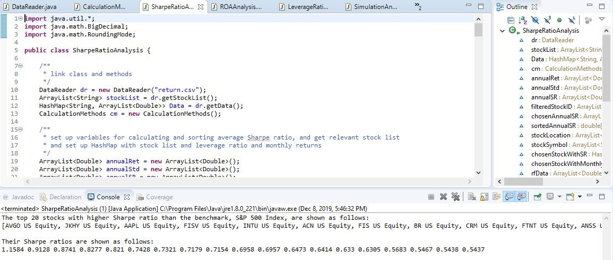
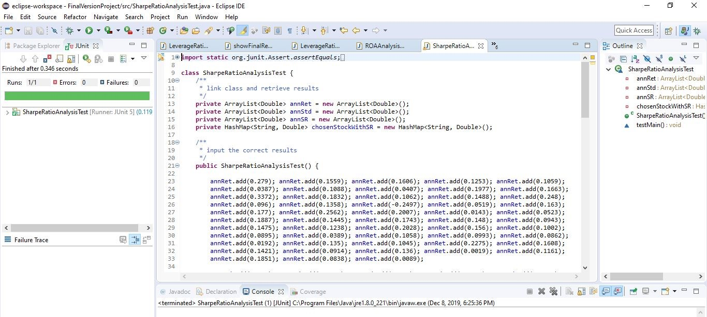
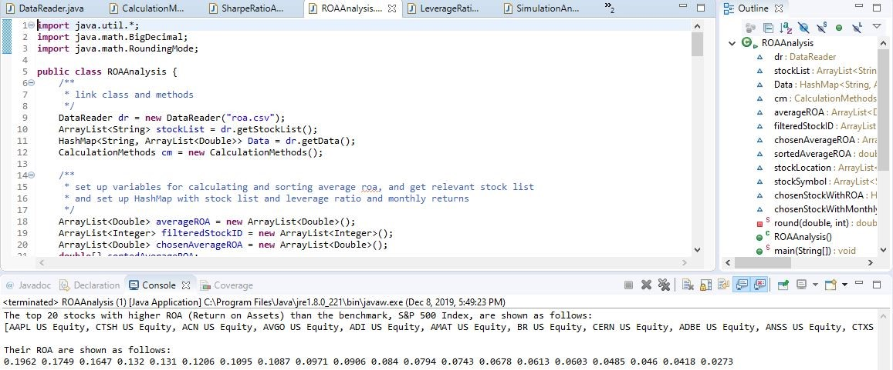
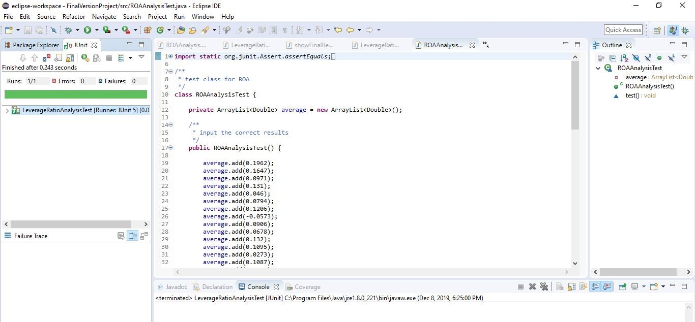
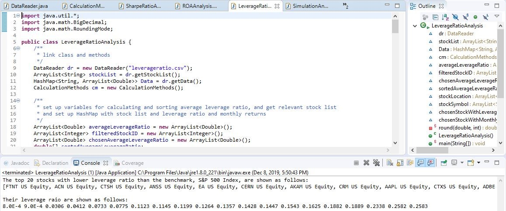
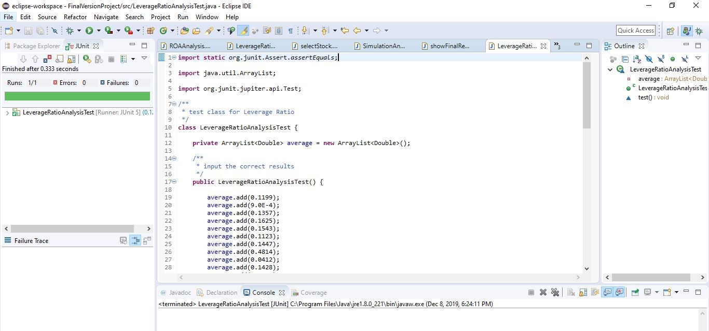
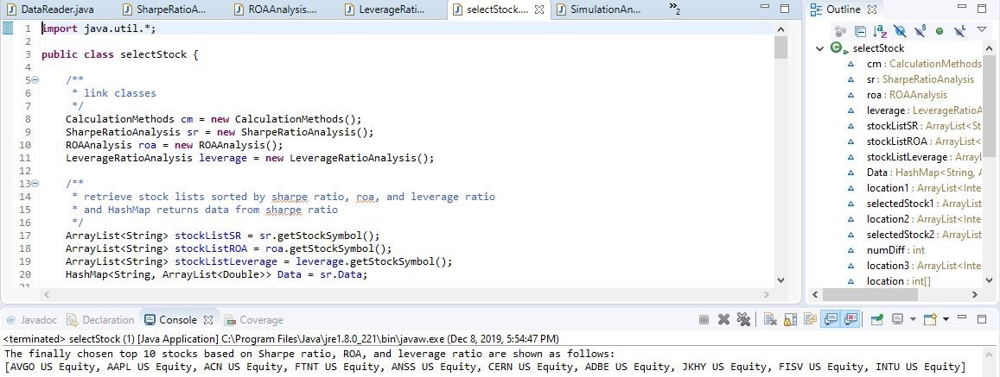
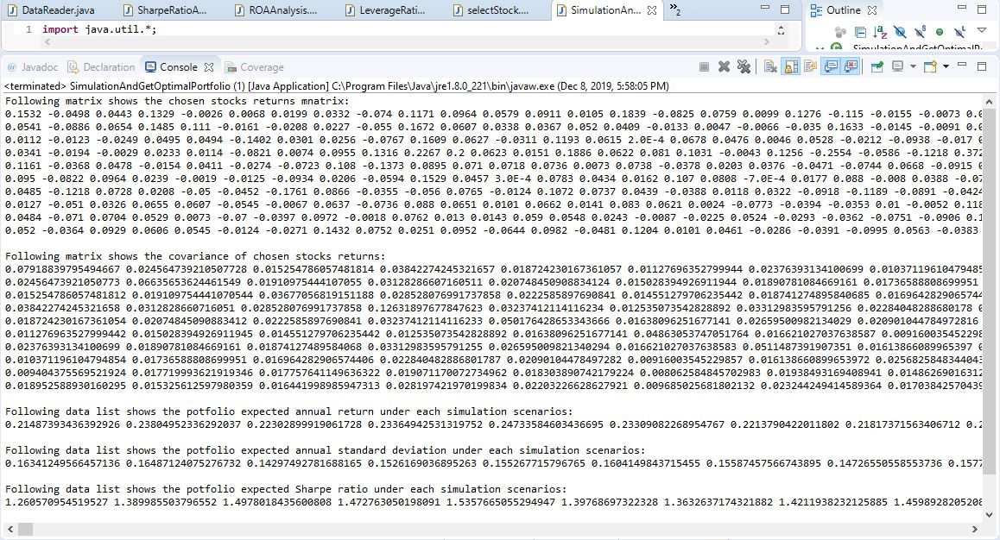
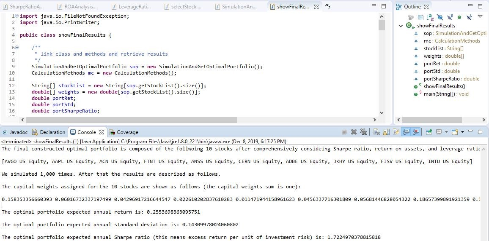

# final-project-85-optimal-portfolio
final-project-85-optimal-portfolio created by GitHub Classroom
This README file provide detailed information of the project we did. We wrote the detailed illustration based on following several aspects.

1. Team Members
2. Project Overview.
3. Finance Theory Brief Description
4. Steps We Did
5. Description and Demo of Our Coding

Team Members

Shengyang Xu: shygxu@seas.upenn.edu
Seseg Baimbetova: sesegb@seas.upenn.edu

Project Overview

We did a project to select top 10 good-performing stocks, and form an optimal portfolio which is composed of the 10 stocks by running 1,000 simulation times to assign them different capital weights. In the 1,000 simulation scenarios, the portfolio that has the highest Sharpe ratio is the optimal portfolio.

Finance Theory Brief Description 

In order to select the top 10 stocks, we use three criteria, including:

Sharpe ratio: this measures stock or portfolio excess return per unit of total investment risk. The higher Sharpe ratio, the better. So we need to choose stocks that have higher Sharpe ratio than the benchmark, S&P 500 Index. Also, we need to choose the portfolio that has the highest Sharpe ratio from simulations.

ROA (return on assets): this measures stock capability to get profits. The higher ROA, the better. So we need to choose stocks that have higher ROA than the benchmark, S&P 500 Index.

Leverage ratio (debt/assets): this measures how much a public company borrow debt. If a public company has too much debt, it is dangerous that it may not pay the debt. Thus, the lower leverage ratio, the better. So we need to choose stocks that have lower leverage ratio than the benchmark, S&P 500 Index.

Steps We Did

Based on above description, we did following tasks to finish the project.

1. Download stocks monthly returns data, quarterly ROA, and quarterly leverage ratio data from Bloomberg, respectively. You can see in there are three csv files named “return.csv”, “ROA.csv”, and “leverageratio.csv” in our folder.

2. Read all the data from the three files into Java for calculation respectively.

3. Select top 20 stocks that has higher Sharpe ratio than the benchmark, S&P 500 Index, based on Sharpe ratio analysis. Junit Test the results and verify the results are correct.

4. Select top 20 stocks that has higher ROA (return on assets) than the benchmark, S&P 500 Index, based on ROA analysis. Junit Test the results and verify the results are correct.

5. Select top 20 stocks that has lower leverage ratio than the benchmark, S&P 500 Index, based on leverage ratio analysis. Junit Test the results and verify the results are correct.

6. Find the common stocks in the three stocks list filter out by the three criteria, and select 10 stocks from the common stocks lists that has top 10 highest Sharpe ratio. If the number of the common stocks is less than 10, we will add remaining stocks from the stock list filter by Sharpe ratio.
7. Get monthly returns of the chosen top 10 stock, and calculate the covariance matrix of the 10 stocks and calculate the annual geometric return of the 10 stocks.

8. Generate 1,000 random capital weights scenarios, and then calculate portfolio expected annual return, portfolio expected annual standard deviation, and portfolio expected annual Sharpe ratio respectively under the 1,000 scenarios.

9. Compare and find the highest portfolio expected annual Sharpe ratio, and find the relevant weights that generate the highest Sharpe ratio. Such capital weights is the optimal portfolio capital weights. Besides, we also find the relevant portfolio annual expected return and relevant portfolio annual expected standard deviation under this optimal scenario.

10. Output the results to tell the optimal portfolio capital weights, expected annual return, expected annual standard deviation, and expected annual Sharpe ratio.

Description and Demo of Our Coding

1. We wrote a class called “DataReader” to read data from “return.csv”, “ROA.csv”, and “leverageratio.csv”, respectively. Please see “DataReader”.

2. We wrote a class called “SharpeRatioAnalysis” to generate the top 20 stocks that has higher Sharpe ratio then the benchmark, S&P 500 Index. This class is built based on the basis of “DataReader” class, as we read returns data into the class “SharpeRatioAnalysis”, and calculated and compared the Sharpe ratio, and then find the top 20 Sharpe ratio, and the relevant stock symbols.

If you run this class, you will get the following results showing the top 20 stocks with highest Sharpe ratio.

Please see picture in the next page.

3. We wrote a class called “SharpeRatioAnalysisTest” to test the results we got from “SharpeRatioAnalysis” class. The test verified our results are correct.

Please see following picture.

4. We wrote a class called “ROAAnalysis” to generate the top 20 stocks that has higher ROA then the benchmark, S&P 500 Index. This class is built based on the basis of “DataReader” class, as we read ROA data into the class “ROAAnalysis”, and calculated and compared ROA, and then find the top 20 ROA, and the relevant stock symbols.

If you run this class, you will get the following results showing the top 20 stocks with highest ROA.

5. We wrote a class called “ROAAnalysisTest” to test the results we got from “ROAAnalysis” class. The test verified our results are correct.

Please see following picture.

6. We wrote a class called “LeverageRatioAnalysis” to generate the top 20 stocks that has lower leverage ratio then the benchmark, S&P 500 Index. This class is built based on the basis of “DataReader” class, as we read leverage ratio data into the class “LeverageRatioAnalysis”, and calculated and compared leverage, and then find the bottom 20 leverage ratio, and the relevant stock symbols.

If you run this class, you will get the following results showing the top 20 stocks with lowest leverage ratio.

7. We wrote a class called “LeverageRatioAnalysisTest” to test the results we got from “LeverageRatioAnalysis” class. The test verified our results are correct.

Please see following picture.

8. Then, in  the class “selectStock”, we find the common top 10 stocks by filtering in the stocks list obtained from “SharpeRatioAnalysis”, “ROAAnalysis”, and “LeverageRatioAnalysis”. This class “selectStock” is based on the results from class “SharpeRatioAnalysis”, “ROAAnalysis”, and “LeverageRatioAnalysis”.

If you run this class, you will get the following result showing the top 10 chosen stocks.

9. Then after we get the chosen top 10 stocks, we need to get their returns data and their covariance matrix for calculating portfolio expected annual return, standard deviation, and Sharpe ratio. We realized all of these things in the class “SimulationAndGetOptimalPortfolio”.

In this class, we also record optimal portfolio expected annual expected return, standard deviation, Sharpe ratio, and optimal weights each time we simulated. And we will re-simulate again to get another optimal portfolio expected annual expected return, standard deviation, Sharpe ratio, and optimal weights. Then, by calculating the average, we get the final optimal portfolio optimal weights, expected annual return, standard deviation, and Sharpe ratio. By this way, the obtained optimal weights, expected annual return, standard deviation, and Sharpe ratio are much more accurate and precise.

If you run this class, you will get the following result showing the top 10 chosen stocks returns matrix, covariance matrix, portfolio expected annual return under each simulation scenarios, portfolio expected annual standard deviation under each simulation scenarios, portfolio expected Sharpe ratio under each simulation scenarios, and portfolio sorted expected Sharpe ratio from highest to lowest.

10. Finally, in the class “showFinalResults”, we output the results.

If you run this class, you will get the following results showing the optimal portfolio underlying 10 stocks, optimal capital weights assigned to the 10 stocks, optimal portfolio expected annual return, optimal portfolio expected annual standard deviation, and optimal portfolio expected annual Sharpe ratio.

11. Illustration of class “CalculationMethods”

In order to support all the calculations of the project, we set up a class “CalculationMethods”, in which we wrote all the methods needed for running the project.

•	double calculateAnnRet(ArrayList<Double> values) is used to calculate the annualized geometric return of an double ArrayList. Please line 7 to 19.

•	double calculateAverage(ArrayList<Double> values) is used to calculate the average of an double ArrayList. Please see line 21 to 33.

•	double calculateAnnStd(ArrayList<Double> values, double average) is used to calculate the annualized standard deviation of an double ArrayList. Please see line 35 to 49.

•	double[] newSort(double[] values) is used to sort numbers sorted by Arrays.sort() from highest to lowest, as the number sorted by Arrays.sort() is from lowest to highest. Please see line 51 to 73.

•	printArray(double[] values) is used to print double[] array list. Please see line 75 to 84.

•	printArray(int[] values) is used to print int[] array list. Please see line 86 to 95.

•	printArray(String[] values) is used to print String[] array list. Please see line 97 to 106.

•	printBoard(double[][] values) is used to print double[][] array list. Please see line 108 to 119.

•	int getMinLength(ArrayList<String> stockList, HashMap<String, ArrayList<Double>> returns) is used to get the minimum length of all returns series. Please see line 121 to 136.

•	double calculateAverage(double[] values) is used to calculate the average of an double[] values. Please see line 138 to 150.

•	double calculateAnnRet(double[] values) is used to calculate the annualized geometric return of an double[] array. Please see line 152 to 165.

•	double calculateStd(double[] values) is used to calculate the standard deviation of an double[] values. Please see line 166 to 180.

•	double sumProduct(double[] x, double[] y) is used to calculate the sumproduct of two series of double[] values. Please line 182 to 195.

•	double[][] getReturnsData(ArrayList<String> stockList, HashMap<String, ArrayList<Double>> returns) is used to get returns data of all stocks in a double[][] format. Please see line 197 to 215.

•	double[][] calculateCovriance(double[][] returnsData) is used to calculate the covariance matrix of returns of all the stocks. Please see line 217 to 255.

•	double[][] transformMatrix(double[][] Matrix) is used to transform a double[][] matrix for matrix multiplication. Please see line 257 to 270.

•	double[][] transformMatrix(double[] Matrix) is used to transform a double[] matrix for matrix multiplication. Please see line 272 to 283.

•	double[] multiplyMatrix(double[] matrix1, double[][] matrix2) is specifically used to multiply a double[] array matrix with a double[][] matrix. Please see line 285 to 300.

•	double calculatePortStd(double[] weight, double[][] covariance) is specifically used to get the final portfolio standard deviation. Please see line 302 to 316.

•	double calculatePortRet(double[] weight, double[] annRet) is used to calculate the final portfolio return. Please see line 318 to 328.

•	double[] generateRandomNumber(int n) is to generate a double[] array with n random numbers with their sum to be one. Please see line 330 to 344.

•	double calculateSum(double[] values) is used to calculate the sum of a double[] array. Please see line 346 to 357.
